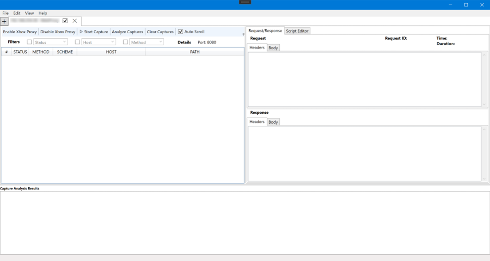
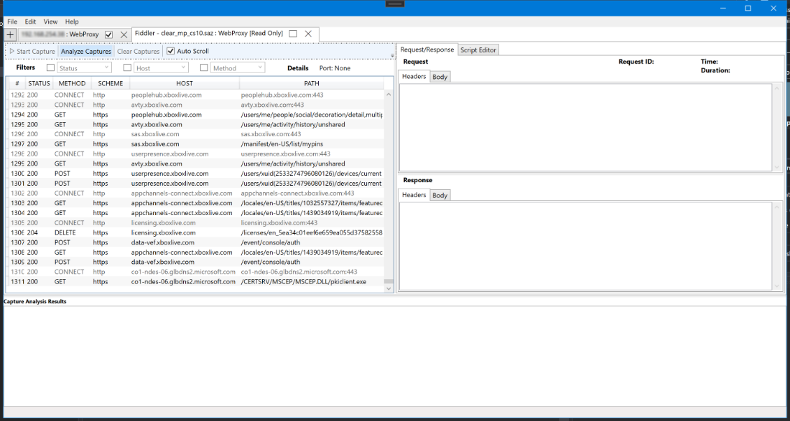
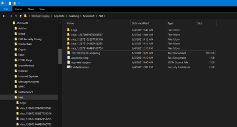
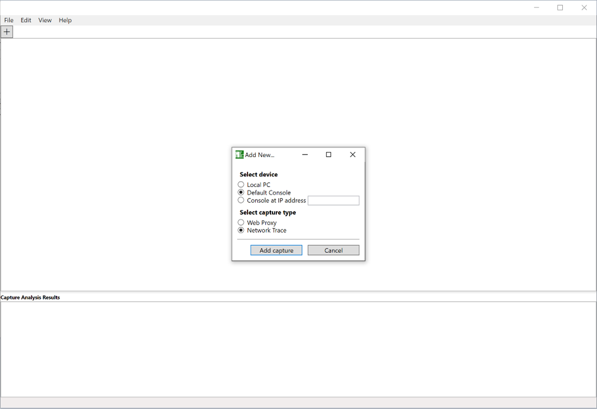

# Xbox Multiplayer Analysis Tool

## Description

Xbox Multiplayer Analysis Tool is a network traffic capturing tool to aid in the debugging of Xbox services issues and other network
traffic from both a PC and Xbox development console. It incorporates features to proxy web and low-level
network requests and responses in real-time, decrypt and view SSL traffic, modify traffic on the fly, and
analyze Xbox services and network traffic for problems.

## Basic Environment Requirements & Dependencies

Xbox Multiplayer Analysis Tool requires a Windows 10 (or higher) PC.

Low level network capture requires an Xbox One, or Xbox Series Developer Kit running recovery 2106 or
higher.

## Table of Contents

- **[Web Proxying with a Device](#web-proxying-with-a-device)**
- **[Scripting & Modification of Web Proxy Traffic](#scripting--modification-of-web-proxy-traffic)**
- **[Live Trace Analysis](#live-trace-analysis)**
- **[Network Capture](#network-capture)**
- **[Network Capture Analysis](#network-capture-analysis)**
- **[Known Issues](#known-issues)**
- **[Support](#support)**
- **[Trademarks](#trademarks)**

## Web Proxying with a Device

### Introduction to Web Proxying a Device

The Xbox development kit provides the developer with the capability to proxy their web service traffic
leaving the box to various hosts. Searching for the keyword “Fiddler” within the GDK documentation will
list pages related to this topic. However, all the steps listed within that documentation are no longer
required to proxy traffic if one is using Xbox Multiplayer Analysis Tool.

### Proxying a Device

We will outline in this section basic steps for using Xbox Multiplayer Analysis Tool to proxy your web service traffic coming
from/to your Xbox development kit. When your kit is set to run the Dev Home experience and is not
proxying, it may look like below after successful boot up. This kit is running the June 2021 recovery.

_Screenshot of a kit that has not enabled proxying its web traffic._

From Xbox Multiplayer Analysis Tool, clicking on the “+” tab will inform Xbox Multiplayer Analysis Tool to add a device and capturing method to the
application like so:

_Screenshot of the default console being added for capturing (proxying) web traffic._

The “Default Console” is a convenience option that allows the user to not have to enter in the IP address
for the designated default console. After clicking on the “Add capture” button from the selector dialog
box, Xbox Multiplayer Analysis Tool will create a new tab for that combination of device and capture method, and display a blank
capture data view.

The port shown below is set to 8080, and that port was chosen according to the available proxy ports that
can be set within the **Preferences** dialog box. You can access the preferences from the **Edit/Preferences**
menu option, and then switch to the “Web Proxy” preferences tab. Xbox Multiplayer Analysis Tool provides some defaults, but
these can be altered and saved like so:

_Screenshot of the ports being used for proxying web traffic._

Note that once a port has been chosen for a particular device that is being captured (proxied), changing
the available proxy ports from the preferences will not alter the designated port for the already added

### device proxy session.

### Enabling/Starting Proxying

As mentioned previously, enabling a console kit for proxying web service traffic traditionally took many
steps that are outlined within the GDK documentation, as well as other sources. With Xbox Multiplayer Analysis Tool, those steps
have been drastically reduced and automated. All that is required is to hit the “Enable Xbox Proxy” button
on the tool bar for the device tab. Enabling proxying for a kit requires the kit to reboot and will begin
expecting successful proxying upon restart. As a result, enabling a kit for proxying implicitly starts
proxying immediately.

_Screenshot of Xbox Multiplayer Analysis Tool when hitting the Enable Proxy button._

A kit will remain enabled to proxy until told to disable proxying through the “Disable Xbox Proxy” tool bar
option, even after successive console reboots, and restarts of the Xbox Multiplayer Analysis Tool application.

A console that has successfully enabled proxying of web service traffic will provide a notification to the kit
like what is shown below. Even though the Fiddler app is not actually being executed, the words “Fiddler
enabled” in the notification, and on the front of the kit, will indicate success.

_Screenshot of a kit that now has proxying of web traffic enabled._

Within the Xbox Multiplayer Analysis Tool application’s device tab that was opened earlier, the user should now start to see
proxied connections populate within the connections list view like so:

_Screenshot of web traffic activity displayed in the connections list view._

For those that are accustomed to using previous versions of Fiddler that worked “out of the box” --
providing root certificates that are compatible with Xbox development kits, the list of connections on the
left, and a display of a particular connection’s request/response data on the right pane, will be very

familiar.

The “Auto Scroll” option is enabled by default so that the app will keep pace with newer connections as

they come in, and status codes are filled in once a response for a particular request is received. One can
prevent the auto scrolling behavior by unchecking it so that a connection item can be kept in view and
inspected.

### Viewing Request & Response Data

While proxying, we can launch an app installed on the kit – like the ATG NetRumble sample – and see the
traffic created as a result of the app’s activity like below:

_Screenshot of user Xbox services sign-in for the ATG NetRumble sample._

As a result of the Xbox services user signin process that happens at the start of the app, we can click on the
individual user authentication request and response in Xbox Multiplayer Analysis Tool. The “Headers” and “Body” tabs show
formatted text for the separate request and response. In addition, additional connection details are
provided that include when the request was made, and how long the request took to complete (when the
response was received).

_Screenshot of viewing individual request/response data for a connection._

### Filtering Displayed Requests & Responses

On the tool bar on will notice that the connections list can be filtered according to checked values found
within the data for various fields. For proxied data, one can filter on a set of status codes, hosts, and
methods. The drop lists show all of the possible values found within the data, and only checked values
will display in the connection list. Multiple fields can be filtered at once.

_Screenshot of filtering the connections list by host._

The connections list will filter in real time as connections are being received and proxied, and the filters
will dynamically update. Toggling between “ALL/NONE” allows for including or excluding a small set of
values in the connections list. Status codes that are equal to or above 400 are color coded (to red) as they
indicate an error condition.

_Screenshot of filtering also by status to further prune connections._

### Stopping Proxying

Proxying may be stopped from with Xbox Multiplayer Analysis Tool for a specific device by clicking on the “Stop Capturing”
button on the tool bar. Disabling proxing for a device will cause the kit to reboot and no longer route
web service traffic through the Xbox Multiplayer Analysis Tool proxy, thereby implicit stopping proxying.

If proxying remains enabled, but Xbox Multiplayer Analysis Tool is not proxying web traffic for that particular device, then the kit
will fail to perform Xbox services status checks, as well as successfully execute other Xbox services related APIs or
REST requests. The kit will eventually show an “unknown” status like this:

_Screenshot of a kit that has enabled proxying but proxying has been stopped._

If a device tab is left open within Xbox Multiplayer Analysis Tool, and the Xbox Multiplayer Analysis Tool app is terminated. Upon execution of Xbox Multiplayer Analysis Tool the
next time, the opened device tab is remembered and automatically reopened like shown below. The
connections list will be clear until proxying resumes for that device.

_Screenshot when Xbox Multiplayer Analysis Tool is closed and reopened -- previous capture device is remembered._

## Scripting & Modification of Web Proxy Traffic

The script editor allows you to write simple C# scripts to modify any or all of the HTTP(S) requests and
responses that are passing through the proxy, on-the-fly. Scripts are written per client (tab) and are not
global across all clients. Clicking on the **Script Editor** tab on the right side of the main application window
will open the script editor view.

Screenshot of Xbox Multiplayer Analysis Tool Script Editor

There are three different events that are scriptable:
**SSL Connection Request** – This script is called when a proxied client makes an HTTPS CONNECT request
to a server.
**Web Request** – This script is called after an HTTP request has left the client, but before the request is
forwarded to the server.
**Web Response** – This script is called after the HTTP response is received by the server, but before it is
forwarded to the client.

Sample scripts are provided as you select each event type to get you started.

All inspectable and modifiable properties are members of the **Params** object. **Params** contains the web
**Request** and the web **Response** objects, as well as a Boolean named **Continue** which can be set to **_false_**
to cancel the request or response in progress. The right side of the script editor shows these objects and
properties. Click on any item in the list to get a description of the property, and double-clicking on any
item will drop the appropriate text into the script editor at the current cursor position.

For example, you could write a script on the **Web Request** event to redirect all calls to a certain URL to
another URL. Or, you could change a **Web Response** which might have a 200 success status to a 500
status to determine how your client/title code behaves in the case of an error. Note that the
**System.Text.Json** namespace is available to use in the scripting engine for easily parsing and
manipulating JSON content.

To enable a script, complete your code in the text editor, then click the **Enable** button. If any errors are
detected in the script, the **Script Compilation Status** window will display these errors. Double-click on
any error in the list to go to the source of the error in the script window. Once the script is enabled, all
future requests and responses will pass through the script silently, and any modifications you have
created in the script code will be applied.

You can also use the **Load** and **Save** buttons to load scripts you have already written and save new scripts
to disk for later usage. The **Revert to Saved** button can also be used to undo any changes since the last
time the script was saved to disk.

There are several known issues and limitations with the scripting functionality:

- The script editor does not have any syntax highlighting or IntelliSense/auto-completion – it is just
    a text box.
- Not all .NET namespaces/objects are available in the scripting environment.

## Live Trace Analysis

### Introduction to Xbox Live Trace Analysis

The Xbox Live Trace Analyzer tool has traditionally been a standalone command line tool for performing rule-
based analysis against Fiddler web service capture files with extension SAZ. It continues to be supported
and is provided with the Microsoft GDK. One can also build their own tool directly from source as it is
available on a public GitHub repository. Xbox Multiplayer Analysis Tool has the Xbox Live Trace Analyzer’s capabilities built
directly within and are invaluable for detecting problematic Xbox services REST API calling patterns discovered
amongst a title’s web service traffic.

### Execution of analysis

In order to perform the analysis, one must first have web service proxy data -- which can be either a
loaded Xbox Multiplayer Analysis Tool (.XMATCAP) file, an imported Fiddler (.SAZ) file, or from real-time proxied requests & responses.

_Screenshot of imported Fiddler (SAZ) capture data about to be analyzed._

Clicking on the “Analyze Captures” tool button will present the list of available analyzers that can be
chosen to execute on the proxied connections currently found within the visible tab.

_Screenshot of the analyzer selector which allows Xbox Live Trace analysis._

Once the “Start Analyzer” button is clicked, Xbox Multiplayer Analysis Tool will display and populate a new tab within the “Capture
Analysis Results” portion of the main app window found toward the bottom of the screen:

_Screenshot of the Xbox Live Trace analysis in progress._

The analysis will undergo many steps which includes the export of analysis related files placed in the
**/AppRoaming/Microsoft/Xbox Multiplayer Analysis Tool** storage directory. The folder will have a prefix of “xlca_” and contain a
timestamp for the executed analysis. Analysis can occur simultaneously with other captures and analysis
occurring on other devices.

_Screenshot of Xbox Multiplayer Analysis Tool Xbox Live Capture Analysis result output folders._

### The Per Endpoint Report

When analysis has completed, the analysis tab’s progress content is replaced with a series of result report
tabs. The first and main report is the Per Endpoint report. This report contains two main sections: the
summary, and the details. The summary table contains a matrix of service host against analysis rule issue
counts. When there are no issues discovered, the box is green. If there are issues encountered, then the
box is colored a brighter orange.

_Screenshot of the Per Endpoint Report with Issue Count Summary data table._

Clicking on a box within the summary table will scroll the report view down to the expander for that host
& rule combination. If the expander for the issues is opened, a table of rule related data is presented
along with the list of individual warnings.

The individual warnings provide explanatory text for why the calls found within its expander invoked the
rule warning. Above the rule data table, a description of what the rule searches for is given:

_Screenshot of the analysis rule warning details list._

Every call pertaining to the rule warning is provided on its own line and includes the actual request
number that corresponds to the request within the connections list, along with the URL for the call.
Clicking on the request number button will ensure that the device tab for the analyzed captures is

opened, and will also select the corresponding request like shown:

_Screenshot of one of the rule warnings’ request selected in the connections list._

In the example presented above, there exist many Xbox services APIs that can take several users as parameters for
the API call. The warning notes that only one user was provided to the API as can be seen when

inspecting the actual request body JSON seen in the above screenshot.

Reducing the quantity of calls to Xbox services REST APIs is always preferable to prevent throttled call
execution, reduce overall bandwidth consumption, and ease load and latency for calls.

### The Statistics Report

The second report tab after the Per Endpoint report is the statistics report which serves as an auxiliary
report that provides interesting data points from the analysis. The topmost graph of the report is the
“Calls Per Endpoint” bar graph that indicates how many calls were made to specific endpoints:

_Screenshot of the Live Trace Analysis statistics report Host call graph._

Beneath the calls bar graph, one will find the timeline graph for the various calls made over the course of
all the analyzed requests & responses. The timeline graph can be zoomed in and out using the mouse
wheel over a particular place within the graph to view more granular timing detail. The color key in the
upper right corner of the graph indicates which hosts were called at specific points in time.

_Screenshot of the statistics report calls timeline and average call times table._

Analysis report content present in its output folder within the Xbox Multiplayer Analysis Tool data storage folder can be removed
if no longer needed once the Analysis results tab for that analysis run is closed.

## Network Capture

### Introduction to Network Capture

The network capture feature of Xbox Multiplayer Analysis Tool allows for the capture of packet-level network traffic from your
Xbox development kit. It is similar in feature taking captures with xbtrace netcap and viewing them in
NetMon. That process is still available and currently provides higher fidelity data. However, Xbox Multiplayer Analysis Tool can
be used to capture, view console network traffic as well as perform some basic analysis and the entire
process takes place inside the Xbox Multiplayer Analysis Tool UI.

### Capturing Network Data

From Xbox Multiplayer Analysis Tool, clicking on the “+” tab will inform Xbox Multiplayer Analysis Tool to add a device and capturing method to the
application. Select your console and choose Network Trace like so:

You will now be presented with a **NetworkTrace** tab and the application is ready to begin a capture.

Pressing **Start Capture** will begin the process of connecting to the console and starting the network
capture. Xbox Multiplayer Analysis Tool will display **Trace Running** while the console is capturing until **Stop Capture** is invoked
in Xbox Multiplayer Analysis Tool. Once that occurs, the console will begin to process the capture and Xbox Multiplayer Analysis Tool will then download
the capture. For large captures, this can take some time.

After the capture is downloaded, the data will be presented in the UI where it can be filtered and viewed
individually.

The trace data can be saved for later viewing and analysis by using the **Load** and **Save Captures** items in
the File menu.

Invoking **Clear Captures** will remove the current data set, **Start Capture** will clear the data and start a
new capture, and **Analyze Capture** will open a new **Analysis Results** tab below.

## Network Capture Analysis

### Introduction to Network Capture Analysis

Xbox Multiplayer Analysis Tool has the ability to gather some general statistics and perform a basic analysis. This includes packet
send statistics by source.

### Running Analysis

To start the analysis, first set any filters in order to reduce the data to the relevant packets and then select
Analyze Capture. The results will open in a new tab below as seen here:

The analysis checks for UDP packets sent in excess of the recommended Xbox MTU (1384), sending more
than (20) packets in a second and sending duplicate packets within a second. If any of these are detected,
the report will show a red background in the list.

## Known Issues

**Enabling Proxying on a Device twice with a different port the second time will fail to proxy.**
_Workaround: Make sure to disable proxying first, before re-enabling to ensure the port setting is correct._

**Proxying with the same header spanned across multiple lines fails to proxy correctly.**
_Workaround: None currently. Apps like Outlook may fail to function properly when proxying PC._

**Enabling proxying does not confirm settings with user, nor allow cancellation of the process.**
_Workaround: Be sure to double check that your console device is ready to reboot when enabling._

**Potential Future Improvements:**

- Keep alive handling needs further improvement.
- Web sockets are not supported yet.
- Root certificate(s) and analysis output(s) are not stored in a user specified location.
- Additional Localization

## Support

If you run into issues using the application, please select the **Help > Collect Debug Logs** menu which will
zip up application logs and place them on your Desktop. Once complete, please send these logs to
xmat_oss@microsoft.com with a description of the problem so that we may review. Additionally, if the
application encounters an unknown error, logs will automatically be placed on your desktop. Please note
that contents of web requests and responses may be included in this log data.

If an error occurs during network capture it is highly recommended that you reboot the console you were
utilizing as the trace may still be running and the capture service will likely continue to fail if not restarted.

## Trademarks
This project may contain trademarks or logos for projects, products, or services. Authorized use of Microsoft trademarks or logos is subject to and must follow [Microsoft’s Trademark & Brand Guidelines](https://www.microsoft.com/en-us/legal/intellectualproperty/trademarks/usage/general). Use of Microsoft trademarks or logos in modified versions of this project must not cause confusion or imply Microsoft sponsorship. Any use of third-party trademarks or logos are subject to those third-party’s policies.
